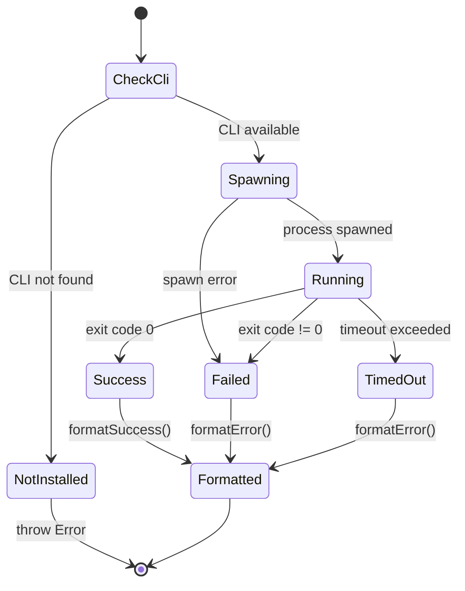

# CLI Execution State Machine

**Last Updated:** 2026-02-19
**Related Files:**
- `src/lib/cli-runner.ts` (spawn wrapper)
- `src/lib/cli-check.ts` (availability check)
- `src/lib/output-parser.ts` (result formatting)

## Overview

## State: CheckCli

**Purpose:** Verify CRE CLI binary exists and is executable
**Entry Actions:**
- Resolve CLI path from `CRE_CLI_PATH` env or default `~/.cre/bin/cre`
- Check file exists with `X_OK` permission
**Allowed Transitions:**
| Event | Target | Guard | Side Effects |
|-------|--------|-------|--------------|
| CLI found | Spawning | accessSync succeeds | Return path |
| CLI missing | NotInstalled | accessSync throws | — |

## State: Spawning

**Purpose:** Creating child process for CLI command
**Entry Actions:**
- `spawn(cliBin, args, { cwd, timeout, env, stdio })`
- Attach stdout/stderr collectors
**Allowed Transitions:**
| Event | Target | Guard | Side Effects |
|-------|--------|-------|--------------|
| process created | Running | — | Buffers accumulating |
| spawn error | Failed | — | Error captured |

## State: Running

**Purpose:** CLI process executing, collecting output
**Data Context:**
- stdout chunks: Buffer[]
- stderr chunks: Buffer[]
**Allowed Transitions:**
| Event | Target | Guard | Side Effects |
|-------|--------|-------|--------------|
| close (code 0) | Success | — | Buffers concatenated |
| close (code != 0) | Failed | — | Buffers concatenated |
| timeout | TimedOut | timeout ms exceeded | Process killed |

## State: Success / Failed / TimedOut

**Purpose:** Terminal states producing CliResult
**Data Context:**
- stdout: string
- stderr: string
- exitCode: number
- success: boolean

## Source Code Mapping

| State/Transition | File | Line | Function |
|------------------|------|------|----------|
| CheckCli | src/lib/cli-check.ts | 16-24 | requireCreCli() |
| Spawning | src/lib/cli-runner.ts | 18-25 | runCli() |
| Running (stdout) | src/lib/cli-runner.ts | 27 | proc.stdout.on |
| Running (stderr) | src/lib/cli-runner.ts | 28 | proc.stderr.on |
| close handler | src/lib/cli-runner.ts | 30-34 | proc.on("close") |
| error handler | src/lib/cli-runner.ts | 36-43 | proc.on("error") |
| formatSuccess | src/lib/output-parser.ts | 9-15 | formatSuccess() |
| formatError | src/lib/output-parser.ts | 17-25 | formatError() |
