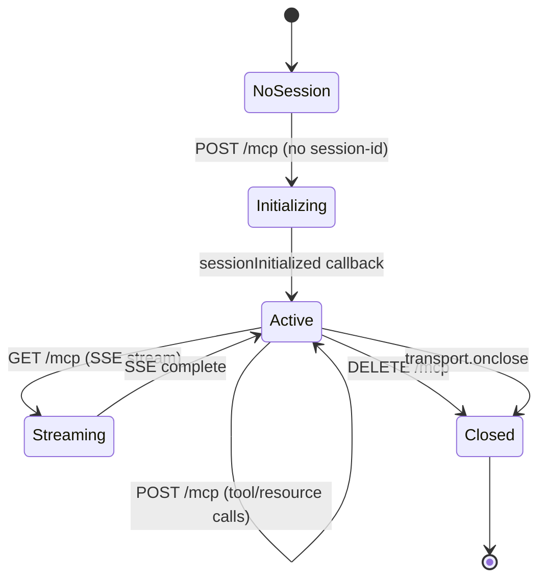

# MCP Session State Machine

**Last Updated:** 2026-02-19
**Related Files:**
- `src/index.ts` (session management, Express routes)
- `src/server.ts` (McpServer creation)

## Overview

## State: NoSession

**Purpose:** No active MCP session — waiting for client initialization
**Entry Actions:** None
**Allowed Transitions:**
| Event | Target | Guard | Side Effects |
|-------|--------|-------|--------------|
| POST /mcp (no session-id) | Initializing | valid JSON-RPC initialize request | Create StreamableHTTPServerTransport, create McpServer |

## State: Initializing

**Purpose:** Transport created, awaiting session ID assignment
**Entry Actions:**
- Create `StreamableHTTPServerTransport` with `sessionIdGenerator`
- Create `McpServer` via `createServer()`
- Call `server.connect(transport)`
**Allowed Transitions:**
| Event | Target | Guard | Side Effects |
|-------|--------|-------|--------------|
| onsessioninitialized | Active | session ID generated | Store transport in `sessions` Map |

## State: Active

**Purpose:** Session established, processing MCP requests
**Data Context:**
- sessionId: string (UUID)
- transport: StreamableHTTPServerTransport
- server: McpServer (tools + resources registered)
**Allowed Transitions:**
| Event | Target | Guard | Side Effects |
|-------|--------|-------|--------------|
| POST /mcp | Active | valid mcp-session-id header | `transport.handleRequest()` |
| GET /mcp | Streaming | valid mcp-session-id header | SSE stream opened |
| DELETE /mcp | Closed | valid mcp-session-id header | Session cleanup |
| transport.onclose | Closed | — | Remove from sessions Map |

## State: Closed

**Purpose:** Session terminated, resources released
**Entry Actions:**
- Remove transport from `sessions` Map
- Transport resources released

## Source Code Mapping

| State/Transition | File | Line | Function |
|------------------|------|------|----------|
| NoSession → Initializing | src/index.ts | 24-37 | POST /mcp handler (no sessionId) |
| onsessioninitialized | src/index.ts | 28 | onsessioninitialized callback |
| transport.onclose | src/index.ts | 32-34 | onclose handler |
| Active (request) | src/index.ts | 40-46 | POST /mcp handler (with sessionId) |
| Health check | src/index.ts | 17-23 | GET /health |
