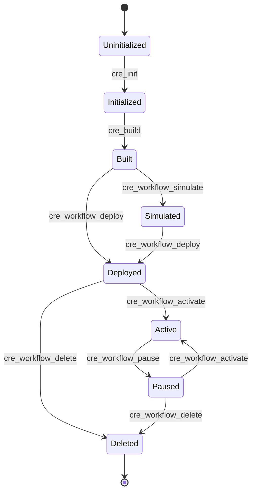

# CRE Workflow Lifecycle State Machine

**Last Updated:** 2026-02-19
**Related Files:**
- `src/tools/project.ts` (init, build)
- `src/tools/workflow.ts` (simulate, deploy, activate, pause, delete)
- `src/tools/docs.ts` (lifecycle documentation)

## Overview

## State: Uninitialized

**Purpose:** No CRE project exists yet
**Allowed Transitions:**
| Event | Target | Guard | Side Effects |
|-------|--------|-------|--------------|
| cre_init | Initialized | valid projectName, workflowName, template | Creates project directory, workflow.yaml, handler.ts |

## State: Initialized

**Purpose:** Project scaffolded with handler code, not yet compiled
**Allowed Transitions:**
| Event | Target | Guard | Side Effects |
|-------|--------|-------|--------------|
| cre_build | Built | valid workflowPath, Bun installed | Compiles handler.ts → WASM binary |

## State: Built

**Purpose:** WASM binary compiled, ready for testing or deployment
**Allowed Transitions:**
| Event | Target | Guard | Side Effects |
|-------|--------|-------|--------------|
| cre_workflow_simulate | Simulated | — | Runs locally with mock inputs |
| cre_workflow_deploy | Deployed | authenticated | Pushes to Chainlink registry |

## State: Simulated

**Purpose:** Workflow tested locally with mock inputs
**Allowed Transitions:**
| Event | Target | Guard | Side Effects |
|-------|--------|-------|--------------|
| cre_workflow_deploy | Deployed | authenticated | Pushes to Chainlink registry |

## State: Deployed

**Purpose:** Workflow registered on-chain, not yet running
**Allowed Transitions:**
| Event | Target | Guard | Side Effects |
|-------|--------|-------|--------------|
| cre_workflow_activate | Active | authenticated | Starts execution on DON |
| cre_workflow_delete | Deleted | authenticated | Removes from registry |

## State: Active

**Purpose:** Workflow running on DON, processing triggers
**Allowed Transitions:**
| Event | Target | Guard | Side Effects |
|-------|--------|-------|--------------|
| cre_workflow_pause | Paused | authenticated | Stops execution, preserves state |

## State: Paused

**Purpose:** Workflow suspended, can be reactivated
**Allowed Transitions:**
| Event | Target | Guard | Side Effects |
|-------|--------|-------|--------------|
| cre_workflow_activate | Active | authenticated | Resumes execution on DON |
| cre_workflow_delete | Deleted | authenticated | Removes from registry |

## State: Deleted

**Purpose:** Workflow permanently removed from DON

## Source Code Mapping

| State/Transition | File | Line | Tool |
|------------------|------|------|------|
| cre_init | src/tools/project.ts | 8-21 | cre_init |
| cre_build | src/tools/project.ts | 23-35 | cre_build |
| cre_workflow_simulate | src/tools/workflow.ts | 8-19 | cre_workflow_simulate |
| cre_workflow_deploy | src/tools/workflow.ts | 21-32 | cre_workflow_deploy |
| cre_workflow_activate | src/tools/workflow.ts | 34-45 | cre_workflow_activate |
| cre_workflow_pause | src/tools/workflow.ts | 47-58 | cre_workflow_pause |
| cre_workflow_delete | src/tools/workflow.ts | 60-71 | cre_workflow_delete |
